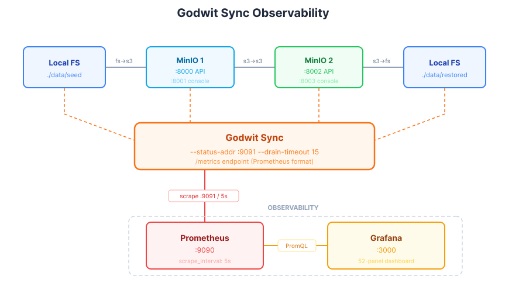

# Lab: Monitor Godwit Sync Migrations with Prometheus and Grafana

Hands-on lab for the article:
**[Monitor S3 Migrations in Real Time with Godwit Sync, Prometheus, and Grafana](https://godwit.io/blog/godwit-grafana-dashboards)**



## Lab Overview

Run S3 migrations with a full observability stack. Prometheus scrapes Godwit Sync metrics every 5 seconds, and Grafana renders them in a pre-provisioned 52-panel dashboard. Two migration scripts are included:

- **`migrate.sh`** -- Multi-round, three-hop migration (~20 minutes). See details below.
- **`migrate-12500.py`** -- Single-round, 12 500-object versioned migration with Object Lock. See details below.

| Service    | Port                             | Purpose                              |
| ---------- | -------------------------------- | ------------------------------------ |
| MinIO 1    | `:8000` (API), `:8001` (console) | Source S3 storage                    |
| MinIO 2    | `:8002` (API), `:8003` (console) | Destination S3 storage               |
| Prometheus | `:9090`                          | Scrapes Godwit Sync metrics every 5s |
| Grafana    | `:3000`                          | Pre-provisioned 52-panel dashboard   |

Both scripts share the same infrastructure. Pick either one (or run both sequentially) depending on what you want to observe.

### migrate.sh -- Multi-Round with Varying Throttle

Four rounds of three hops each (~20 minutes). Each round uses a separate S3 prefix (`round-1/`, `round-2/`, ...) and a different throttle rate (30, 60, 40, 80 MB/s) to create visible throughput pattern changes in the charts.

| Hop | Source                      | Destination                           | Direction |
| --- | --------------------------- | ------------------------------------- | --------- |
| 1   | `./data/seed` (local files) | MinIO 1 `:8000` `demo-bucket/round-N` | `fs->s3`  |
| 2   | MinIO 1 `:8000`             | MinIO 2 `:8002` `demo-bucket/round-N` | `s3->s3`  |
| 3   | MinIO 2 `:8002`             | `./data/restored-N` (local files)     | `s3->fs`  |

Each round also runs a version-history migration (`versioned-src` -> `versioned-dst`, `--version-mode all`) and a final object-lock migration (`ol-src` -> `ol-dst`). Seed data: 180 files (4.3 GB) + versioned and object-lock objects.

### migrate-12500.py -- Large Object Count, Single Round

Single round with 12 500 object versions across 6 200 unique keys. 700 keys carry 10 versions each (versioned bucket with `--version-mode all`), 5 500 keys are single-version. 200 keys have Object Lock (100 GOVERNANCE retention, 100 legal hold). ~5% of versions are large (65-75 MB) to trigger multipart uploads. The seed script generates ~44 GB of data, which fits within the 50 GB free per-run tier, so no license is required. For larger object counts, [register on godwit.io](https://godwit.io/) for an unlimited 30-day trial license -- no credit card required. Migrates MinIO 1 to MinIO 2 with `--version-mode all --object-lock`, then verifies checksums. **Deliberately throttled to 5 MB/s** (`--read-bps`) so the migration runs long enough to observe Grafana panels updating in real time; remove the flag for full-speed transfers. To re-run, reset the destination first with `python3 scripts/clean-dst-12500.py`.

| Step    | Source                     | Destination                | Direction |
| ------- | -------------------------- | -------------------------- | --------- |
| Migrate | MinIO 1 `:8000` `many-src` | MinIO 2 `:8002` `many-dst` | `s3->s3`  |
| Verify  | (checksums on MinIO 2)     |                            |           |

Uses a separate state database (`many.state.db`).

### Shared Details

Every hop runs with `--status-addr :9091` and `--drain-timeout 15` (three times the 5-second Prometheus scrape interval), exposing Prometheus metrics at `http://localhost:9091/metrics`. The drain timeout keeps the metrics server alive after each hop completes, allowing Prometheus to scrape the final values before the process exits. The Grafana dashboard updates in near real-time.

## Prerequisites

- **Docker** and **Docker Compose v2** -- `docker compose version`
- **Godwit Sync** binary on `PATH` -- `godwit version`
- **Python 3** with `boto3` -- `python3 -m pip install boto3`

If `godwit version` fails, install Godwit Sync from the [Quickstart guide](https://godwit.io/docs/quickstart).
If you run scripts with `python` instead of `python3` (common on Windows), install `boto3` with `python -m pip install boto3`.

## Quick Start

### 1. Start the environment

```bash
docker compose -f infra/docker-compose.yml up -d
```

Wait for all four services to pass their health checks:

```bash
docker compose -f infra/docker-compose.yml ps --format "table {{.Name}}\t{{.Status}}"
```

Expected:

```
NAME                          STATUS
godwit-lab-minio              Up (healthy)
godwit-lab-minio2             Up (healthy)
godwit-lab-prometheus         Up (healthy)
godwit-lab-grafana            Up (healthy)
```

### 2. Seed data and create the MinIO buckets

```bash
python3 scripts/seed-data.py
# or, if your environment uses `python`:
python scripts/seed-data.py
```

This seeds the data described in the [migrate.sh](#migratesh----multi-round-with-varying-throttle) section above.

For the large-object-count migration, also run:

```bash
python3 scripts/seed-data-12500.py
```

This seeds the data described in the [migrate-12500.py](#migrate-12500py----large-object-count-single-round) section above (~44 GB). Runs on the free 50 GB per-run tier -- see that section for details.

### 3. Open Grafana

Before running the migration, open the Grafana dashboard:

1. Navigate to `http://localhost:3000`
2. Log in with `admin` / `admin` (skip password change)
3. The **Godwit Sync** dashboard loads automatically as the home dashboard
4. Set the time range to **Last 30 minutes**
5. Enable **auto-refresh** every 5 seconds (top-right dropdown)

Service URLs and credentials are in the [Lab Overview](#lab-overview) table.

### 4. Run a migration

**Option A -- Multi-round (`migrate.sh`):**

```bash
bash scripts/migrate.sh
```

**Option B -- Large object count (`migrate-12500.py`):**

```bash
python3 scripts/migrate-12500.py
```

See the [companion article](https://godwit.io/blog/godwit-grafana-dashboards) for a walkthrough of each dashboard row with screenshots.

### 5. Inspect runs individually

Run IDs follow the pattern `r{round}-hop{hop}` (e.g., `r1-hop2`, `r3-hop1`).

Bash/zsh:

```bash
godwit plan inspect \
  --run-id r1-hop2 \
  --state-path ./godwit.state.db
```

PowerShell:

```powershell
godwit plan inspect `
  --run-id r1-hop2 `
  --state-path ./godwit.state.db
```

List all runs (shows all 12 hops across 4 rounds):

Bash/zsh:

```bash
godwit plan list \
  --state-path ./godwit.state.db
```

PowerShell:

```powershell
godwit plan list `
  --state-path ./godwit.state.db
```

### 6. Verify checksums for a specific round

The script verifies each round automatically. To re-verify a specific round manually:

Bash/zsh:

```bash
godwit plan verify \
  --run-id r1-hop2 \
  --destination s3://demo-bucket/round-1 \
  --destination-endpoint localhost:8002 \
  --destination-secure=false \
  --state-path ./godwit.state.db \
  --brief
```

PowerShell:

```powershell
godwit plan verify `
  --run-id r1-hop2 `
  --destination s3://demo-bucket/round-1 `
  --destination-endpoint localhost:8002 `
  --destination-secure=false `
  --state-path ./godwit.state.db `
  --brief
```

### 7. Tear down

```bash
bash scripts/cleanup.sh
```

This stops and removes all Docker containers and volumes, and deletes `./data`, `./data/restored-*`, and `./godwit.state.db`.

## Dashboard Panels

The Grafana dashboard (`infra/grafana/dashboards/godwit-sync.json`) contains 48 panels across 8 rows:

| Row        | Panel                          | PromQL                                                                                    |
| ---------- | ------------------------------ | ----------------------------------------------------------------------------------------- |
| Overview   | Objects Progress               | `godwit_objects{state="done"} / godwit_objects{state="total"} * 100`                      |
| Overview   | Bytes Progress                 | `godwit_bytes{state="done"} / godwit_bytes{state="total"} * 100`                          |
| Overview   | ETA                            | `godwit_eta_seconds`                                                                      |
| Overview   | Failed Objects                 | `godwit_objects{state="failed"}`                                                          |
| Overview   | Run Stage                      | `godwit_run_stage == 1`                                                                   |
| Overview   | Active Workers                 | `godwit_active_workers`                                                                   |
| Overview   | Pending Objects                | `godwit_objects{state="pending"}`                                                         |
| Throughput | Throughput (bytes/s)           | `godwit_throughput_bytes_per_second`, `rate(godwit_run_transfer_bytes_total[1m])`         |
| Throughput | Task Duration                  | `histogram_quantile(0.5\|0.95\|0.99, rate(godwit_task_duration_seconds_bucket[5m]))`      |
| Throughput | Object Size Distribution       | `histogram_quantile(0.5\|0.95\|0.99, rate(godwit_object_size_bytes_bucket[5m]))`          |
| Throughput | S3 Requests by Operation       | `rate(godwit_requests_total[1m])`                                                         |
| Breakdown  | Objects by State               | `godwit_objects`                                                                          |
| Breakdown  | Bytes by State                 | `godwit_bytes`                                                                            |
| Breakdown  | Duration by Phase              | `godwit_duration_seconds`                                                                 |
| Breakdown  | Cumulative Bytes by Direction  | `rate(godwit_bytes_total[1m])`                                                            |
| Multipart  | Upload Type                    | `godwit_upload_type_total`                                                                |
| Multipart  | Multipart Sessions             | `godwit_multipart_sessions_total`                                                         |
| Multipart  | Multipart Resume Ratio         | `godwit_multipart_sessions_total{action="resumed"} / (created + resumed)`                 |
| Multipart  | S3 Request Latency             | `histogram_quantile(0.5\|0.95\|0.99, rate(godwit_s3_request_seconds_bucket[5m]))`         |
| Multipart  | Multipart Parts                | `godwit_multipart_parts_total`                                                            |
| Multipart  | Part Latency                   | `histogram_quantile(0.5\|0.95\|0.99, rate(godwit_part_latency_seconds_bucket[5m]))`       |
| Multipart  | Parts per Object               | `histogram_quantile(0.5\|0.95\|0.99, rate(godwit_multipart_parts_per_object_bucket[5m]))` |
| Errors     | Retries by Direction           | `godwit_retries_total`                                                                    |
| Errors     | Object Failure Rate            | `rate(godwit_objects_total{status="failed"}[5m])`                                         |
| Errors     | Wasted Bytes                   | `godwit_partial_upload_wasted_bytes_total`                                                |
| Errors     | Verification Results           | `godwit_verify_total`                                                                     |
| Errors     | Verify Failure Rate            | `rate(godwit_verify_total{result=~"mismatched\|error"}[5m])`                              |
| Errors     | Task Attempts Distribution     | `histogram_quantile(0.5\|0.95\|0.99, rate(godwit_task_attempts_bucket[5m]))`              |
| Errors     | Source List Retries            | `godwit_source_list_retries_total`                                                        |
| Errors     | Warnings                       | `godwit_warnings`                                                                         |
| Per-Run    | Run Progress                   | `godwit_run_objects_completed / godwit_run_objects_total * 100`                           |
| Per-Run    | Run Wall-Clock Duration        | `godwit_run_completed_timestamp - godwit_run_started_timestamp`                           |
| Per-Run    | Storage Class (objects)        | `godwit_storage_class_objects`                                                            |
| Per-Run    | Run Bytes (transferred/total)  | `godwit_run_bytes_transferred`, `godwit_run_bytes_total`                                  |
| Per-Run    | Run Objects (failed/skipped)   | `godwit_run_objects_failed`, `godwit_run_objects_skipped`                                 |
| Per-Run    | Run Bytes Verified             | `godwit_run_bytes_verified`                                                               |
| Per-Run    | Storage Class (bytes)          | `godwit_storage_class_bytes`                                                              |
| Per-Run    | Version History Keys           | `godwit_version_history_keys`                                                             |
| Per-Run    | Object Lock Versions           | `godwit_object_lock_versions`                                                             |
| Verify     | Verify Counts (live)           | `godwit_verify_total{result="matched\|mismatched\|error"}`                                |
| Verify     | Verify Bytes Progress          | `godwit_run_bytes_verified / godwit_run_bytes_total * 100`                                |
| Verify     | Verify Objects Progress        | `godwit_run_objects_verified / godwit_run_objects_total * 100`                            |
| Verify     | Verify Duration                | `godwit_verify_duration_seconds`                                                          |
| Config     | Read BPS Limit                 | `godwit_config_read_bps`                                                                  |
| Config     | RPS Limit                      | `godwit_config_rps`                                                                       |
| Config     | Buffer Capacity & Max Inflight | `godwit_buffer_capacity`, `godwit_config_max_inflight`                                    |
| Config     | Retry Configuration            | `godwit_config_max_retries`, `godwit_config_retry_base_delay_seconds`                     |
| Runtime    | Goroutines                     | `go_goroutines`                                                                           |
| Runtime    | Heap Memory                    | `go_memstats_heap_inuse_bytes`, `go_memstats_alloc_bytes`                                 |
| Runtime    | CPU Rate                       | `rate(process_cpu_seconds_total[1m])`                                                     |
| Runtime    | Open FDs                       | `process_open_fds`                                                                        |

## Troubleshooting

| Symptom                                        | Fix                                                                                                |
| ---------------------------------------------- | -------------------------------------------------------------------------------------------------- |
| `TLS handshake error`                          | Check that `--source-secure=false` / `--destination-secure=false` are present                      |
| Prometheus shows `DOWN` for godwit target      | Godwit Sync must be running with `--status-addr :9091`; target is only up during a hop             |
| Grafana shows "No data"                        | Ensure Prometheus is scraping (check `http://localhost:9090/targets`); run a migration first       |
| Grafana dashboard is empty after migration     | Check time range covers the migration window (last 30 minutes)                                     |
| `host.docker.internal` not resolving           | On Linux, ensure Docker 20.10+ or add `--add-host=host.docker.internal:host-gateway`               |
| `ModuleNotFoundError: No module named 'boto3'` | Install with the same interpreter: `python3 -m pip install boto3` or `python -m pip install boto3` |

<!-- Copyright (c) 2026 Godwit.io. Licensed under the MIT License. -->
