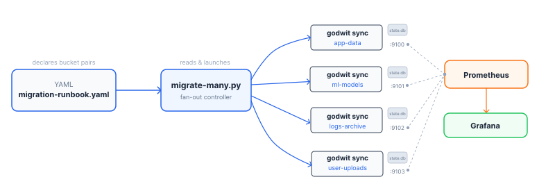
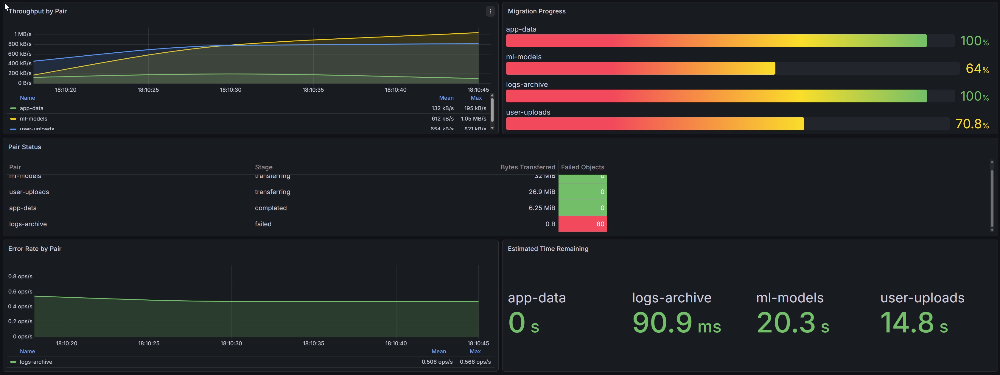

# Lab: Multi-Bucket S3 Migration Orchestration

Hands-on lab for the article:
**[Migrate Multiple S3 Buckets in Parallel](https://godwit.io/blog/multi-bucket-s3-migration-orchestration)**



## Lab Overview

Migrate four S3 buckets in parallel from a source RustFS instance to a target RustFS instance using a YAML runbook and a Python orchestrator. Prometheus scrapes per-pair metrics, and Grafana renders them in a pre-provisioned dashboard. One pair (logs-archive) is pre-configured to fail so you can practice the retry workflow.

| Service       | Port                             | Purpose                                |
| ------------- | -------------------------------- | -------------------------------------- |
| RustFS Source | `:7000` (API), `:7010` (console) | 4 pre-seeded buckets                   |
| RustFS Target | `:7001` (API), `:7011` (console) | Empty target buckets                   |
| Prometheus    | `:7090`                          | Scrapes Godwit Sync on 7100--7103      |
| Grafana       | `:7030`                          | Pre-provisioned multi-bucket dashboard |

The four bucket pairs:

| Pair         | Objects | Size per Object | Prometheus Port |
| ------------ | ------- | --------------- | --------------- |
| app-data     | 100     | 64 KB           | `:7100`         |
| ml-models    | 50      | 1 MB            | `:7101`         |
| logs-archive | 80      | 128 KB          | `:7102`         |
| user-uploads | 120     | 64--512 KB      | `:7103`         |

## Scripts

The lab uses two Python scripts with distinct roles:

| Script                    | Purpose                                              | Reusable outside this lab?                     |
| ------------------------- | ---------------------------------------------------- | ---------------------------------------------- |
| `scripts/setup-lab.py`    | Seed test data and manage failure injection          | No -- lab-specific                             |
| `scripts/migrate-many.py` | Orchestrate parallel Godwit Sync across config files | Yes -- works with any set of migration configs |

## Prerequisites

- **Docker** and **Docker Compose v2** -- `docker compose version`
- **Godwit Sync** binary on `PATH` -- `godwit version`
- **Python 3** with `boto3` -- `python3 -m pip install boto3`
- **PyYAML** -- `python3 -c "import yaml"` (install with `pip install pyyaml`)

If `godwit version` fails, install Godwit Sync from the [Quickstart guide](https://godwit.io/docs/quickstart).
If you run scripts with `python` instead of `python3` (common on Windows), install `boto3` with `python -m pip install boto3`.

## Quick Start

### 1. Start the environment

```bash
docker compose -f infra/docker-compose.yml up -d
```

Wait for all services to pass their health checks:

```bash
docker compose -f infra/docker-compose.yml ps --format "table {{.Name}}\t{{.Status}}"
```

Expected:

```
NAME                              STATUS
multi-bucket-lab-rustfs-source    Up (healthy)
multi-bucket-lab-rustfs-target    Up (healthy)
multi-bucket-lab-prometheus       Up (healthy)
multi-bucket-lab-grafana          Up (healthy)
```

### 2. Seed data

```bash
python3 scripts/setup-lab.py seed
```

This creates four buckets on the source RustFS with test objects, four empty buckets on the target RustFS, and then deletes the target logs-archive bucket (failure injection).

### 3. Review the config files

```bash
ls migrations/
```

Each `.yml` file is a standard Godwit config for one bucket pair, with its own source, destination, RPS limit, Prometheus status address, and state database path. Transfer speeds are throttled via `read_bps` so that migrations take long enough for Prometheus to scrape multiple data points and Grafana to render meaningful throughput graphs.

### 4. Plan the migration

```bash
python3 scripts/migrate-many.py plan
```

Runs `godwit sync --plan-only` for each pair. Review the planned object counts and byte totals before proceeding.

### 5. Execute the migration

```bash
python3 scripts/migrate-many.py run
```

All four pairs launch in parallel as background processes. The orchestrator waits for all of them and prints a results table. Three pairs succeed; logs-archive fails because the target bucket does not exist.

### 6. Open Grafana

1. Navigate to `http://localhost:7030`
2. Log in with `admin` / `admin` (skip password change)
3. The **Multi-Bucket Migration** dashboard loads automatically as the home dashboard
4. Set the time range to **Last 15 minutes**
5. Enable **auto-refresh** every 5 seconds (top-right dropdown)

The dashboard has five panels: Throughput by Pair, Migration Progress, Pair Status table, Error Rate by Pair, and Estimated Time Remaining.



### 7. Observe the logs-archive failure

The results table from step 5 shows logs-archive as FAILED. Start with the log:

```bash
cat state/logs-archive.log
```

The error shows that the target logs-archive bucket does not exist. Now inspect the plan to see how far it got before failing:

```bash
godwit plan inspect --run-id logs-archive --state-path ./state/logs-archive.state.db
```

The output shows the run status, object counts (total, pending, failed), and byte totals. Notice that `failed` is non-zero and `left` accounts for everything that never transferred.

To see the individual failed objects:

```bash
godwit plan list objects failed --run-id logs-archive --state-path ./state/logs-archive.state.db
```

Each row includes the object key, size, and error message. Add `--json` to either command for machine-readable output you can pipe to `jq`.

### 8. Check Grafana for the failure

Go back to the Grafana dashboard at `http://localhost:7030`. The **Pair Status** table shows all four pairs. Three pairs show `completed`; logs-archive shows `failed` with 0 bytes transferred. The **Error Rate by Pair** panel shows a spike for logs-archive during the failed run. The **Migration Progress** bar for logs-archive stays at 0% while the other three reach 100%.

This is the same failure you saw in the logs and plan inspect output, but from the monitoring perspective. In a production migration with dozens of pairs, the dashboard is how you spot failures without tailing individual log files.

### 9. Fix and retry

Recreate the target logs-archive bucket, then retry:

```bash
python3 scripts/setup-lab.py fix-logs-archive
python3 scripts/migrate-many.py retry
```

The orchestrator detects which pairs failed and re-runs only those.

### 10. Verify checksums

```bash
python3 scripts/migrate-many.py verify
```

Runs `godwit plan verify` for each pair to confirm that every object on the target matches the source checksum.

### 11. Check final status

```bash
python3 scripts/migrate-many.py status
```

Prints a summary table with state database status and run status for each pair, plus detailed inspect output for completed runs.

### 12. Tear down

```bash
bash scripts/cleanup.sh
```

This stops and removes all Docker containers and volumes, and deletes the `./state` directory.

## Troubleshooting

| Symptom                                        | Fix                                                                                                |
| ---------------------------------------------- | -------------------------------------------------------------------------------------------------- |
| `TLS handshake error`                          | Check that `--source-secure=false` / `--destination-secure=false` are present                      |
| Prometheus shows `DOWN` for a godwit target    | Godwit Sync must be running; targets are only up during an active migration                        |
| Grafana shows "No data"                        | Ensure Prometheus is scraping (check `http://localhost:7090/targets`); run a migration first       |
| `host.docker.internal` not resolving           | On Linux, ensure Docker 20.10+ or add `--add-host=host.docker.internal:host-gateway`               |
| `ModuleNotFoundError: No module named 'boto3'` | Install with the same interpreter: `python3 -m pip install boto3` or `python -m pip install boto3` |
| `ModuleNotFoundError: No module named 'yaml'`  | Install with: `python3 -m pip install pyyaml`                                                      |

<!-- Copyright (c) 2026 Godwit.io. Licensed under the MIT License. -->
