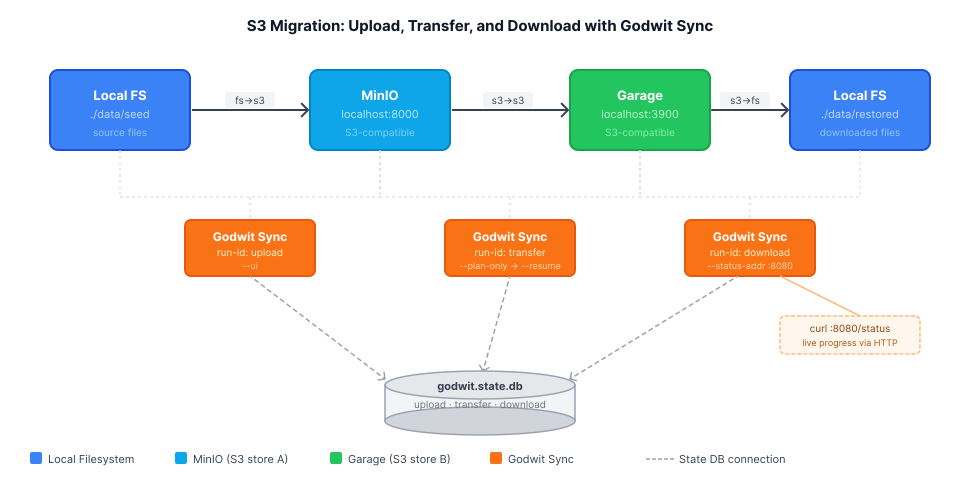
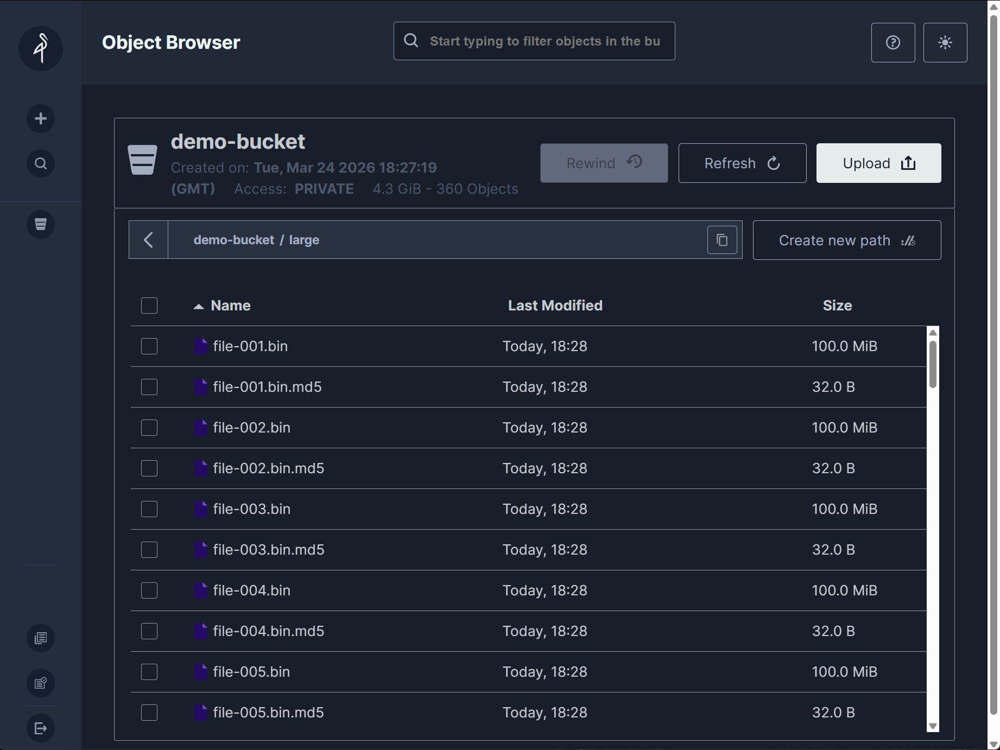
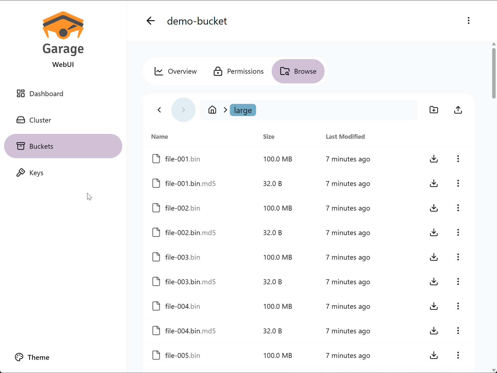

# Lab: S3 Migration Guide -- Upload, Transfer, and Download S3 Data

Hands-on lab for the article:
**[S3 Migration Guide: How to Upload, Transfer, and Download S3 Data](https://godwit.io/blog/s3-migration-guide)**



## What You Will Do

Run three Godwit Sync transfers that demonstrate the three core S3 migration use cases:

| Use Case | Source                      | Destination                     | Direction  | Feature highlight                         |
| -------- | --------------------------- | ------------------------------- | ---------- | ----------------------------------------- |
| Upload   | `./data/seed` (local files) | MinIO `:8000`                   | `fs -> s3` | Basic sync with `--ui`                    |
| Transfer | MinIO `:8000`               | Garage `:3900`                  | `s3 -> s3` | Plan-first: `--plan-only` then `--resume` |
| Download | Garage `:3900`              | `./data/restored` (local files) | `s3 -> fs` | Live monitoring: `--status-addr :8080`    |

Each use case is independently resumable. The download use case exposes a live HTTP status endpoint at `:8080`. After all use cases complete, `godwit plan verify` re-reads Garage and confirms checksums match.

## Prerequisites

- **Docker** and **Docker Compose v2** -- `docker compose version`
- **Godwit Sync** binary on `PATH` -- `godwit version`
- **Python 3** with `boto3` -- `python3 -m pip install boto3`

If `godwit version` fails, install Godwit Sync from the [Quickstart guide](https://godwit.io/docs/quickstart).
If you run scripts with `python` instead of `python3` (common on Windows), install `boto3` with `python -m pip install boto3`.

## Quick Start

### 1. Start the environment

```bash
docker compose -f infra/docker-compose.yml up -d
```

Wait for MinIO and Garage to pass their health checks:

```bash
docker compose -f infra/docker-compose.yml ps --format "table {{.Name}}\t{{.Status}}"
```

Expected:

```
NAME                      STATUS
godwit-lab-garage         Up About a minute (healthy)
godwit-lab-garage-webui   Up About a minute
godwit-lab-minio          Up About a minute (healthy)
```

Check the UIs:

- MinIO console: `http://localhost:8001` (user: `minioadmin`, password: `minioadmin`)
- Garage Web UI: `http://localhost:3909`

If the Garage Web UI does not load, verify the Garage admin API is reachable:

```bash
curl http://localhost:3902/health
```

### 2. Generate seed data

```bash
python3 scripts/seed-data.py
# or, if your environment uses `python`:
python scripts/seed-data.py
```

Expected output:

```
Generating seed data ...
  created small/file-001.bin                 (65,536 bytes)
  ...
  created medium/file-001.bin            (10,485,760 bytes)
  ...
  created large/file-001.bin            (104,857,600 bytes)
  ...
Seed complete: 180 files, 4406.3 MB total

Ready. Run to continue:
  bash scripts/init-minio.sh
  bash scripts/init-garage.sh
  bash scripts/migrate.sh
```

### 3. Initialize MinIO

```bash
bash scripts/init-minio.sh
```

This creates `demo-bucket` in MinIO.

Expected output:

```
==> Waiting for MinIO ...
    MinIO is up.

==> Creating bucket 'demo-bucket' ...
    MinIO: created bucket 'demo-bucket'

==> MinIO initialized.
    Bucket: demo-bucket
```

### 4. Initialize Garage

```bash
bash scripts/init-garage.sh
```

This configures the single-node cluster layout, creates `demo-bucket`, generates an S3 key, and writes the credentials to `.credentials`.

Expected output:

```
==> Waiting for Garage daemon ...
    Garage daemon is up.

==> Configuring cluster layout ...
    Node ID: 4d5eca82251cca0d...
    Layout applied.

==> Creating bucket 'demo-bucket' ...

==> Creating S3 key 'garageadmin' ...

==> Granting key access to 'demo-bucket' ...

==> Garage initialized.
    Bucket:     demo-bucket
    Access key: GK...
    Secret key: ...
    Credentials written to: .credentials

Next step:
  bash scripts/migrate.sh
```

> The Garage key pair is auto-generated and stored in `.credentials`. It is sourced
> by `migrate.sh` at runtime. Do not commit `.credentials` to version control.

### 5. Run all three use cases

```bash
bash scripts/migrate.sh
```

This runs all three use cases in sequence (upload, transfer, download), inspects each run, then verifies the transfer checksums.

> **Note:** Each use case uses `--read-bps 52428800` (~50 MB/s) for demo purposes, so the
> transfer runs slowly enough to observe in real time. Remove the flag for maximum throughput.

**While the download runs**, open a second terminal and poll the live status endpoint:

```bash
curl http://localhost:8888/status | jq .
```

Example response:

```json
{
  "run_id": "transfer",
  "status": "running",
  "source": "s3://demo-bucket",
  "destination": "s3://demo-bucket",
  "started_at": "2026-03-24T18:59:42.118491701Z",
  "finished_at": "2026-03-24T18:59:41.973119325Z",
  "eta_seconds": 55.559615854,
  "objects": {
    "total": 360,
    "done": 8,
    "failed": 0,
    "skipped": 0,
    "excluded": 180,
    "pending": 168,
    "running": 4
  },
  "bytes": {
    "total": 4620293760,
    "done": 838860800,
    "failed": 0,
    "skipped": 0,
    "excluded": 5760,
    "pending": 3361996800,
    "running": 419430400
  },
  "version_history": {
    "complete": 8,
    "partial": 0,
    "fully_skipped": 0
  },
  "storage_classes": [
    {
      "name": "STANDARD",
      "count": 360,
      "bytes": 4620293760,
      "percent": 100
    }
  ],
  "read_retries": 0,
  "write_retries": 0
}
```

You can also verify the uploaded files in the MinIO console at `http://localhost:8001` (user: `minioadmin`, password: `minioadmin`). Notice the `.md5` sidecar file next to each key -- Godwit Sync writes these checksums during upload so transfers can be verified later.



You can verify the transferred files in the Garage Web UI at `http://localhost:3909`. The `.md5` sidecars appear here too -- the transfer step skips them with `--skip .md5`, so only the original keys are copied to Garage.



Expected final output:

```
--- All runs ---
RUN-ID                                    STATUS        STARTED
------                                    ------        -------
upload                                    completed     2026-03-21 10:01:12
transfer                                  completed     2026-03-21 10:02:45
download                                  completed     2026-03-21 10:04:18

--- Verify upload checksums ---
...
Verification complete: 180 objects OK, 0 failed.
```

### 6. Inspect any run individually

Bash/zsh:

```bash
godwit plan inspect \
  --run-id transfer \
  --state-path ./godwit.state.db
```

PowerShell:

```powershell
godwit plan inspect `
  --run-id transfer `
  --state-path ./godwit.state.db
```

### 7. Tear down

```bash
bash scripts/cleanup.sh
```

This stops and removes Docker containers and volumes, and deletes `./data`, `./godwit.state.db`, and `./.credentials`.

## File Layout

```
s3-migration-guide-lab/
  README.md
  infra/
    docker-compose.yml     MinIO + Garage services
    garage.toml            Garage single-node configuration
  scripts/
    seed-data.py           Generate ./data/seed/
    init-minio.sh          Create MinIO bucket
    init-garage.sh         Bootstrap Garage layout, bucket, and key
    migrate.sh             All three use cases + inspect + verify
    cleanup.sh             Tear down containers and local state
  images/
    s3-migration-guide-architecture.svg
```

## Troubleshooting

| Symptom                                        | Fix                                                                                                                       |
| ---------------------------------------------- | ------------------------------------------------------------------------------------------------------------------------- |
| `godwit-lab-garage` stays unhealthy            | Wait 30 s; Garage is slow to initialize on first start                                                                    |
| `TLS handshake error`                          | Check that `--source-secure=false` / `--destination-secure=false` are present                                             |
| `.credentials not found`                       | Run `bash scripts/init-garage.sh` before `migrate.sh`                                                                     |
| Run resumes with 0 objects                     | The run already completed; check `godwit plan inspect` for its status                                                     |
| `demo-bucket` not found in Garage              | Re-run `init-garage.sh`; Garage lost state (volume was removed)                                                           |
| `ModuleNotFoundError: No module named 'boto3'` | Install with the same interpreter used to run the script: `python3 -m pip install boto3` or `python -m pip install boto3` |

<!-- Copyright (c) 2026 Godwit.io. Licensed under the MIT License. -->
