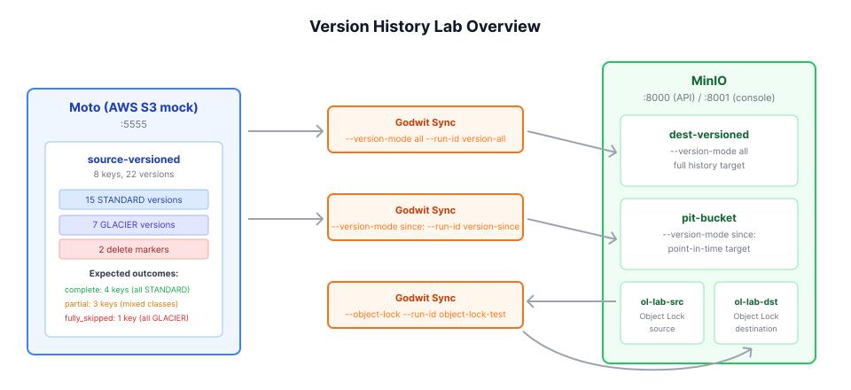

# Lab: S3 Version History and Object Lock Migration

Hands-on lab for the article **[S3 Version History Migration: Step-by-Step with Godwit Sync](https://godwit.io/blog/s3-version-history-migration)**.



## Lab Overview

Migrate versioned S3 objects with mixed storage classes (STANDARD + GLACIER) and replicate Object Lock metadata:

| Run              | Source                          | Destination                    | Mode                                    |
| ---------------- | ------------------------------- | ------------------------------ | --------------------------------------- |
| version-all      | Moto `:5555` `source-versioned` | MinIO `:8000` `dest-versioned` | `--version-mode all` (full history)     |
| version-since    | Moto `:5555` `source-versioned` | MinIO `:8000` `pit-bucket`     | `--version-mode since:` (point-in-time) |
| object-lock-test | MinIO `:8000` `ol-lab-src`      | MinIO `:8000` `ol-lab-dst`     | `--object-lock --version-mode all`      |

The version history runs use a Moto source with 8 keys containing mixed storage classes plus delete markers. The Object Lock run uses MinIO for both source and destination with 4 objects carrying different lock settings. This showcases:

- **Glacier-aware skipping** — GLACIER versions are detected and skipped with warnings, not errors
- **Per-key version completeness** — each key is classified as `complete`, `partial`, or `fully_skipped`
- **Partial history reporting** — `--partial-history` identifies exactly which keys have gaps
- **Delete marker replication** — delete markers are migrated as actual S3 delete markers
- **Point-in-time filtering** — `--version-mode since:` migrates only recent versions
- **Object Lock replication** — `--object-lock` copies retention mode (GOVERNANCE/COMPLIANCE), retain-until-date, and legal hold per-version
- **Object Lock pre-flight validation** — `--object-lock` against a non-lock-enabled bucket fails immediately with a clear error
- **Checksum verification** — `plan verify` confirms every copied version is intact

### Moto Preserves Mixed Storage Classes

MinIO rejects GLACIER as a storage class on PutObject. Moto (AWS S3 mock) preserves StorageClass in `ListObjectVersions` responses and accepts GLACIER on PutObject, making it possible to seed versioned buckets with mixed storage classes.

### MinIO Supports the Full Object Lock API

Moto does not support `GetObjectRetention` / `GetObjectLegalHold`. MinIO supports the full Object Lock API, including `--object-lock-enabled-for-bucket` at creation time, so both source and destination use MinIO for the Object Lock demonstration.

## Prerequisites

- **Docker** and **Docker Compose v2** — `docker compose version`
- **Godwit Sync** binary on `PATH` — `godwit version`
- **Python 3** with `boto3` — `python3 -m pip install boto3`

If `godwit version` fails, install Godwit Sync from the [Quickstart guide](https://godwit.io/docs/quickstart).
If you run scripts with `python` instead of `python3` (common on Windows), install `boto3` with `python -m pip install boto3`.

## Quick Start

### 1. Start the environment

```bash
docker compose -f infra/docker-compose.yml up -d
```

Wait for both services to pass their health checks:

```bash
docker compose -f infra/docker-compose.yml ps --format "table {{.Name}}\t{{.Status}}"
```

Expected:

```
NAME                          STATUS
godwit-version-lab-moto       Up (healthy)
godwit-version-lab-minio      Up (healthy)
```

MinIO console: `http://localhost:8001` (user: `minioadmin`, password: `minioadmin`)

### 2. Seed versioned data with mixed storage classes

```bash
python3 scripts/seed-versioned-data.py
# or, if your environment uses `python`:
python scripts/seed-versioned-data.py
```

This creates versioned buckets on Moto (version history) and MinIO (Object Lock), seeds test data, and creates destination buckets.

Expected output (abbreviated):

```
Preparing source (Moto :5555) and destination (MinIO :8000) ...

Source (Moto):
  Created bucket 'source-versioned'
  Versioning enabled on 'source-versioned'

Destination (MinIO):
  Created bucket 'dest-versioned'
  Versioning enabled on 'dest-versioned'
  Created bucket 'pit-bucket'
  Versioning enabled on 'pit-bucket'

Seeding 8 keys, 25 total versions (15 STANDARD + 10 GLACIER) ...

  single.txt                 1 versions  (1x STANDARD)
  all-ok.txt                 3 versions  (3x STANDARD)
  all-glacier.txt            3 versions  (3x GLACIER)
  half-glacier.txt           4 versions  (2x STANDARD, 2x GLACIER)
  mostly-glacier.txt         4 versions  (1x STANDARD, 3x GLACIER)
  mostly-ok.txt              4 versions  (3x STANDARD, 1x GLACIER)
  docs/report.txt            3 versions  (3x STANDARD)
  docs/archive.txt           3 versions  (2x STANDARD, 1x GLACIER)

Creating delete markers for 2 keys ...
  Deleted docs/report.txt (delete marker created)
  Deleted docs/archive.txt (delete marker created)

Seed complete:
  Keys:             8
  Versions:         25 (15 STANDARD, 10 GLACIER)
  Delete markers:   2
  Total bytes:      1.6 MB
  Midpoint time:    2026-03-30T17:21:58Z
                    (use with --version-mode "since:2026-03-30T17:21:58Z")

Expected migration outcome:
  Copied:           15 STANDARD versions + 2 delete markers
  Skipped (glacier): 10 GLACIER versions
  Partial history:  3 keys (half-glacier, mostly-glacier, mostly-ok)
  Fully skipped:    1 key (all-glacier)

── Object Lock Setup (MinIO → MinIO) ──────────────────────

  Created bucket 'ol-lab-src' (Object Lock enabled)
  Created bucket 'ol-lab-dst' (Object Lock enabled)

Seeding 4 Object Lock test objects ...

  governance-only.dat            lock=[GOVERNANCE]
  compliance-and-hold.dat        lock=[COMPLIANCE, LEGAL_HOLD]
  legal-hold-only.dat            lock=[LEGAL_HOLD]
  no-lock.dat                    lock=[none]

Object Lock seed complete:
  Source bucket:      ol-lab-src (MinIO :8000)
  Destination bucket: ol-lab-dst (MinIO :8000)
  Objects:            4
  GOVERNANCE:         1
  COMPLIANCE:         1
  Legal hold:         2
  No lock:            1
```

### 3. Run the migration

```bash
bash scripts/migrate-versions.sh
```

This runs:

1. **version-all** — Plans and executes `--version-mode all` (STANDARD copied, GLACIER skipped)
2. **Completeness check** — Shows per-key version history classification
3. **Glacier listing** — Lists specific GLACIER versions that were skipped
4. **version-since** — Plans and executes `--version-mode since:` (point-in-time)
5. **Verify** — Confirms checksums on all copied versions
6. **Object Lock** — Syncs with `--object-lock`, replicates retention and legal hold per-version
7. **Object Lock rejection** — Confirms `--object-lock` fails fast against a non-lock-enabled bucket

Expected final output:

```
=========================================
  Version history migration complete.

  version-all:   full history migrated
    - STANDARD versions:  copied
    - GLACIER versions:   skipped (reported)
    - Delete markers:     replicated

  version-since: point-in-time migrated

  object-lock:   Object Lock metadata replicated
    - GOVERNANCE retention: copied
    - COMPLIANCE retention: copied
    - Legal hold:           copied
    - Non-lock bucket:      rejected (pre-flight)
=========================================
```

### 4. Inspect any run individually

Bash/zsh:

```bash
godwit plan inspect \
  --run-id version-all \
  --state-path ./godwit.state.db
```

PowerShell:

```powershell
godwit plan inspect `
  --run-id version-all `
  --state-path ./godwit.state.db
```

Expected output (abbreviated):

```
Storage classes detected:
  STANDARD:             55.6%   15 objects   960.0 KB
  GLACIER:              37.0%   10 objects   640.0 KB
  (none):                7.4%   2 objects   0 B

Version History:
  Complete History:      5 keys
  Partial History:       3 keys
  Fully Skipped:         1 keys
```

**Storage classes:** `(none)` represents the 2 delete markers. Delete markers are zero-byte tombstone records with no storage class in S3.

**Version history** classifies each key (not each version) based on its versions after execution:

| Classification | Condition                                  | Lab example                                                                        |
| -------------- | ------------------------------------------ | ---------------------------------------------------------------------------------- |
| Complete       | All versions are STANDARD (all copied)     | `single.txt`, `all-ok.txt`, `docs/report.txt`, `docs/archive.txt`, `mostly-ok.txt` |
| Partial        | Mix of STANDARD and GLACIER versions       | `half-glacier.txt`, `mostly-glacier.txt`, `mostly-ok.txt`                          |
| Fully Skipped  | All versions are GLACIER (nothing to copy) | `all-glacier.txt`                                                                  |

> **Note:** These counts are only meaningful after execution. At `--plan-only` time, STANDARD versions are still `pending` (not yet `completed`), so the complete/partial counts appear as zero.

### 5. Check version completeness

Bash/zsh:

```bash
# Keys with partial version history (GLACIER gaps)
godwit plan list objects all \
  --partial-history \
  --run-id version-all \
  --state-path ./godwit.state.db

# All glacier-skipped versions
godwit plan list objects glacier \
  --run-id version-all \
  --state-path ./godwit.state.db
```

PowerShell:

```powershell
# Keys with partial version history (GLACIER gaps)
godwit plan list objects all `
  --partial-history `
  --run-id version-all `
  --state-path ./godwit.state.db

# All glacier-skipped versions
godwit plan list objects glacier `
  --run-id version-all `
  --state-path ./godwit.state.db
```

> **Note:** The outputs below are abbreviated (ETAG truncated, MODIFIED and FINISHED columns removed) to fit the screen.

**Partial history output** (`--partial-history` lists every version of keys that have a mix of copied and skipped versions):

```
KEY                   VERSION           LATEST  SIZE      ETAG      STORAGE CLASS  STARTED       STATUS
docs/archive.txt      28acbeac-269e...  no      64.0 KB   02b...    STANDARD       03-30 17:42   completed
docs/archive.txt      40107ed1-667e...  del     0 B       -         (none)         03-30 17:42   completed
docs/archive.txt      7c2acf38-bc9a...  no      64.0 KB   770...    STANDARD       03-30 17:42   completed
docs/archive.txt      cc8b8ddb-a67d...  no      64.0 KB   ecb...    GLACIER        -             glacier
half-glacier.txt      4957c02e-e385...  yes     64.0 KB   892...    GLACIER        -             glacier
half-glacier.txt      5306a153-2cf2...  no      64.0 KB   ded...    STANDARD       03-30 17:42   completed
half-glacier.txt      93e221b1-67a2...  no      64.0 KB   d23...    STANDARD       03-30 17:42   completed
half-glacier.txt      db2448c3-9148...  no      64.0 KB   c64...    GLACIER        -             glacier
mostly-glacier.txt    4aec813c-2c8a...  no      64.0 KB   504...    GLACIER        -             glacier
mostly-glacier.txt    87151a2e-9900...  yes     64.0 KB   57e...    GLACIER        -             glacier
mostly-glacier.txt    c01179c6-273f...  no      64.0 KB   cbc...    GLACIER        -             glacier
mostly-glacier.txt    ed9459db-f110...  no      64.0 KB   0b0...    STANDARD       03-30 17:42   completed
mostly-ok.txt         2d39cc6c-df48...  no      64.0 KB   e99...    STANDARD       03-30 17:42   completed
mostly-ok.txt         48b105d6-e651...  yes     64.0 KB   ba0...    STANDARD       03-30 17:42   completed
mostly-ok.txt         5bfd8714-f48c...  no      64.0 KB   ee3...    GLACIER        -             glacier
mostly-ok.txt         dc6c6ca1-bcaa...  no      64.0 KB   46f...    STANDARD       03-30 17:42   completed

Total: 16 objects, 960.0 KB
```

Four keys appear because each has at least one STANDARD version (`completed`) and at least one GLACIER version (`glacier`). The `del` marker on `docs/archive.txt` shows a delete marker with `(none)` storage class and 0 bytes. `all-glacier.txt` does not appear here because it has no copied versions (fully skipped). Keys like `single.txt` and `all-ok.txt` also do not appear because all their versions were STANDARD (complete history).

**Glacier-skipped output** (lists every individual version that was skipped due to GLACIER storage class):

```
KEY                   VERSION           LATEST  SIZE      ETAG      STORAGE CLASS  STARTED       STATUS
all-glacier.txt       0423cd5f-76cc...  yes     64.0 KB   bbc...    GLACIER        -             glacier
all-glacier.txt       44591ea3-1f6a...  no      64.0 KB   978...    GLACIER        -             glacier
all-glacier.txt       810d26a6-1b4c...  no      64.0 KB   be9...    GLACIER        -             glacier
docs/archive.txt      cc8b8ddb-a67d...  no      64.0 KB   ecb...    GLACIER        -             glacier
half-glacier.txt      4957c02e-e385...  yes     64.0 KB   892...    GLACIER        -             glacier
half-glacier.txt      db2448c3-9148...  no      64.0 KB   c64...    GLACIER        -             glacier
mostly-glacier.txt    4aec813c-2c8a...  no      64.0 KB   504...    GLACIER        -             glacier
mostly-glacier.txt    87151a2e-9900...  yes     64.0 KB   57e...    GLACIER        -             glacier
mostly-glacier.txt    c01179c6-273f...  no      64.0 KB   cbc...    GLACIER        -             glacier
mostly-ok.txt         5bfd8714-f48c...  no      64.0 KB   ee3...    GLACIER        -             glacier

Total: 10 objects, 640.0 KB
```

All 10 GLACIER versions across 5 keys. `all-glacier.txt` appears here (all 3 versions skipped), alongside the individual GLACIER versions from the partial-history keys. Each row has status `glacier` and a `-` in the STARTED column because Godwit Sync never attempted to transfer these versions.

**Filtering with `--json` and `jq`:** Use `--json` to pipe structured output through `jq` and select only the columns you need:

```bash
godwit plan list objects all \
  --partial-history \
  --run-id version-all \
  --state-path ./godwit.state.db \
  --json \
  | jq -r '["KEY","STORAGE CLASS","STARTED","STATUS"],
            (.[] | [.key, (.storage_class // "(none)"), (.started_at // "-"), .status])
            | @tsv' \
  | column -t
```

```
KEY                   STORAGE CLASS  STARTED               STATUS
docs/archive.txt      STANDARD       2026-03-30T17:42:00Z  completed
docs/archive.txt      (none)         2026-03-30T17:42:00Z  completed
docs/archive.txt      STANDARD       2026-03-30T17:42:00Z  completed
docs/archive.txt      GLACIER        -                     glacier
half-glacier.txt      GLACIER        -                     glacier
half-glacier.txt      STANDARD       2026-03-30T17:42:00Z  completed
half-glacier.txt      STANDARD       2026-03-30T17:42:00Z  completed
half-glacier.txt      GLACIER        -                     glacier
mostly-glacier.txt    GLACIER        -                     glacier
mostly-glacier.txt    GLACIER        -                     glacier
mostly-glacier.txt    GLACIER        -                     glacier
mostly-glacier.txt    STANDARD       2026-03-30T17:42:00Z  completed
mostly-ok.txt         STANDARD       2026-03-30T17:42:00Z  completed
mostly-ok.txt         STANDARD       2026-03-30T17:42:00Z  completed
mostly-ok.txt         GLACIER        -                     glacier
mostly-ok.txt         STANDARD       2026-03-30T17:42:00Z  completed
```

STARTED `-` confirms GLACIER versions were never attempted. `(none)` storage class is a delete marker.

### 6. Inspect the point-in-time migration

The `version-since` run used `--version-mode since:<midpoint>` where `<midpoint>` is the timestamp written by the seed script. Only versions created after that midpoint are included in the plan.

Bash/zsh:

```bash
godwit plan inspect \
  --run-id version-since \
  --state-path ./godwit.state.db
```

PowerShell:

```powershell
godwit plan inspect `
  --run-id version-since `
  --state-path ./godwit.state.db
```

Expected output (abbreviated):

```
Objects:
  Total:           13
  Finished:        10

Data:
  Transferred:     512.0 KB
  Left:            192.0 KB
  Total:           704.0 KB

Storage classes detected:
  STANDARD:             61.5%   8 objects   512.0 KB
  GLACIER:              23.1%   3 objects   192.0 KB
  (none):               15.4%   2 objects   0 B

Version History:
  Complete History:      1 keys
  Partial History:       2 keys
  Fully Skipped:         1 keys
```

Compare with the full migration (`version-all`):

| Metric | `version-all` | `version-since` | Difference |
| --- | --- | --- | --- |
| Total objects | 27 | 13 | 14 versions before the midpoint filtered out |
| STANDARD copied | 15 (960 KB) | 8 (512 KB) | Only recent STANDARD versions included |
| GLACIER skipped | 10 (640 KB) | 3 (192 KB) | Older GLACIER versions also filtered out |
| Delete markers | 2 | 2 | Both markers are recent (created after all versions) |
| Complete keys | 5 | 1 | Fewer keys have all their post-midpoint versions in STANDARD |
| Partial keys | 3 | 2 | |
| Fully skipped keys | 1 | 1 | `all-glacier.txt` remains fully skipped |

The `since:` filter applies at plan time: only versions with a `LastModified` after the midpoint timestamp enter the plan. This cuts the total from 27 to 13 objects while the 2 delete markers (created last) are still included.

### 7. Inspect Object Lock results

Bash/zsh:

```bash
godwit plan inspect \
  --run-id object-lock-test \
  --state-path ./object-lock.state.db
```

PowerShell:

```powershell
godwit plan inspect `
  --run-id object-lock-test `
  --state-path ./object-lock.state.db
```

Expected output includes an Object Lock summary:

```
Object Lock:
  Retention (GOVERNANCE):    1 versions
  Retention (COMPLIANCE):    1 versions
  Legal hold (ON):           2 versions
  No lock settings:          1 versions
```

Each line maps to the seed data from step 2:

| Output line               | Source object                                    | Lock applied by seed script                            |
| ------------------------- | ------------------------------------------------ | ------------------------------------------------------ |
| Retention (GOVERNANCE): 1 | `governance-only.dat`                            | GOVERNANCE retention with retain-until date            |
| Retention (COMPLIANCE): 1 | `compliance-and-hold.dat`                        | COMPLIANCE retention with retain-until date            |
| Legal hold (ON): 2        | `compliance-and-hold.dat`, `legal-hold-only.dat` | Legal hold enabled (one also has COMPLIANCE retention) |
| No lock settings: 1       | `no-lock.dat`                                    | No retention or legal hold                             |

Godwit Sync copies retention mode, retain-until date, and legal hold status per-version to the destination. The counts confirm all 4 objects were replicated with their original lock settings intact.

### 8. Tear down

```bash
bash scripts/cleanup.sh
```

This stops and removes Docker containers and volumes, and deletes the state databases.

## Troubleshooting

| Symptom                                                                     | Fix                                                                                                                             |
| --------------------------------------------------------------------------- | ------------------------------------------------------------------------------------------------------------------------------- |
| `godwit-version-lab-moto` stays unhealthy                                   | Wait 15 s; Moto needs time to start the Python server                                                                           |
| `godwit-version-lab-minio` stays unhealthy                                  | Wait 15 s; MinIO needs time to initialize                                                                                       |
| `TLS handshake error`                                                       | Check that `--source-secure=false` / `--destination-secure=false` are present                                                   |
| `source-versioned` not found                                                | Re-run `python3 scripts/seed-versioned-data.py`                                                                                 |
| Run resumes with 0 objects                                                  | The run already completed; check `godwit plan inspect`                                                                          |
| `ModuleNotFoundError: No module named 'boto3'`                              | Install with: `python3 -m pip install boto3` or `python -m pip install boto3`                                                   |
| `version-since` shows 0 versions                                            | The `since:` timestamp is after all versions were created; re-run `seed-versioned-data.py` to regenerate `since-timestamp.txt`  |
| Connection refused on `:5555`                                               | Moto is not running; check `docker compose ps` and restart if needed                                                            |
| `--object-lock requires the destination bucket to have Object Lock enabled` | Expected in Step 7 (rejection test). If unexpected, verify `ol-lab-dst` was created with `--object-lock-enabled-for-bucket`     |
| `AccessDenied` on Object Lock operations                                    | MinIO user needs `s3:GetObjectRetention`, `s3:PutObjectRetention`, `s3:GetObjectLegalHold`, `s3:PutObjectLegalHold` permissions |

<!-- Copyright (c) 2026 Godwit.io. Licensed under the MIT License. -->
